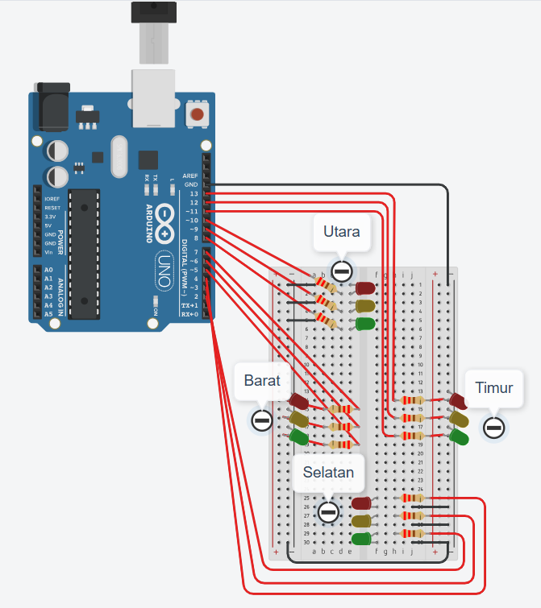
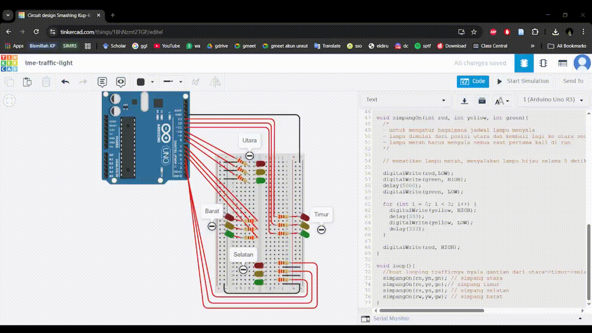

# Traffic Light 4 Arah
## Overview
Proyek ini merupakan simulasi sistem traffic light sederhana menggunakan Arduino yang dibuat melalui platform Tinkercad. Sistem ini mengatur nyala lampu lalu lintas (merah, kuning, hijau) pada empat arah simpang (utara, timur, selatan, barat) secara bergantian.
## Komponen
Komponen  yang digunakan dalam mini proyek ini diantaranya:
* Arduino
* Breadboard
* LED merah, kuning, dan hijau masing masing warna 4 buah
* 12 resistor 220Ω
* Kabel jumper
## Skema

Konfigurasi pin Arduino yang digunakan untuk mengontrol LED pada setiap arah simpang berdasarkan gambar tertera:
| Arah     | Merah | Kuning | Hijau |
|----------|------|--------|-------|
| Timur    | 13   | 12     | 11    |
| Utara    | 10   | 9      | 8     |
| Barat    | 7    | 6      | 5     |
| Selatan  | 4    | 3      | 2     |
## Alur Sistem
Alur kerja sistem traffic light ini adalah sebagai berikut:
1. Semua lampu merah menyala sebagai kondisi awal
2. Lampu hijau pada satu arah menyala selama 5 detik
3. Lampu kuning berkedip 3 kali dalam 2 detik sebagai tanda transisi
4. Lampu kembali ke merah
5. Sistem berpindah ke arah berikutnya (utara → timur → selatan → barat)
6. Proses berlangsung secara berulang (looping)
## Simulasi
Simulasi dilakukan menggunakan platform Tinkercad seperti video berikut:

